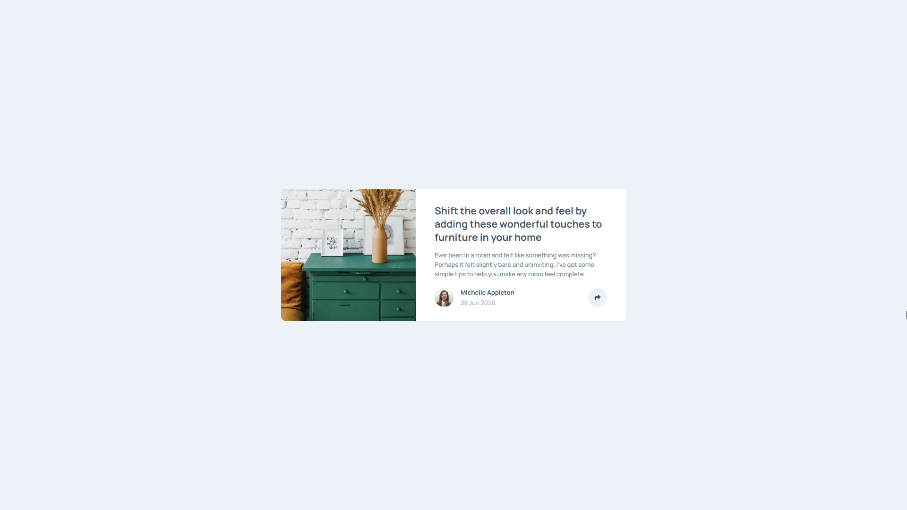
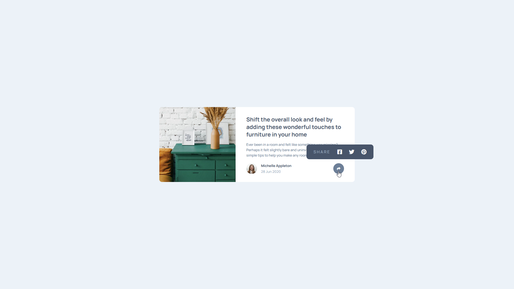
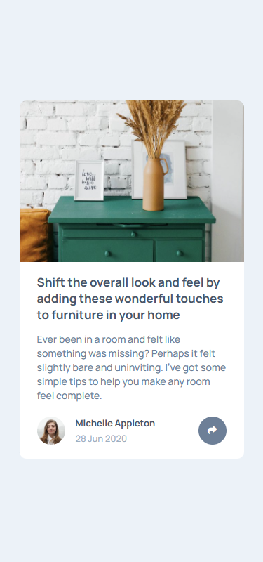
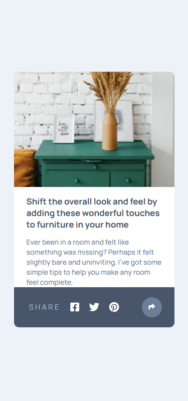

# Frontend Mentor - Article preview component solution

This is a solution to the [Article preview component challenge on Frontend Mentor](https://www.frontendmentor.io/challenges/article-preview-component-dYBN_pYFT). Frontend Mentor challenges help you improve your coding skills by building realistic projects. 

## Overview

### The challenge

Users should be able to:

- View the optimal layout for the component depending on their device's screen size
- See the social media share links when they click the share icon

#### Desktop Screenshot 🖥️

#### Desktop Active State 🖥️

#### Mobile Screenshot 📱

#### Mobile Active Screenshot 📱

### link 🔗

- Live Site URL: https://lkiryu.github.io/article-preview-component/

### Built with 🛠️

- HTML5
- CSS
- JS
---
### Author 👨‍💻
 Made by Matheus Antonio